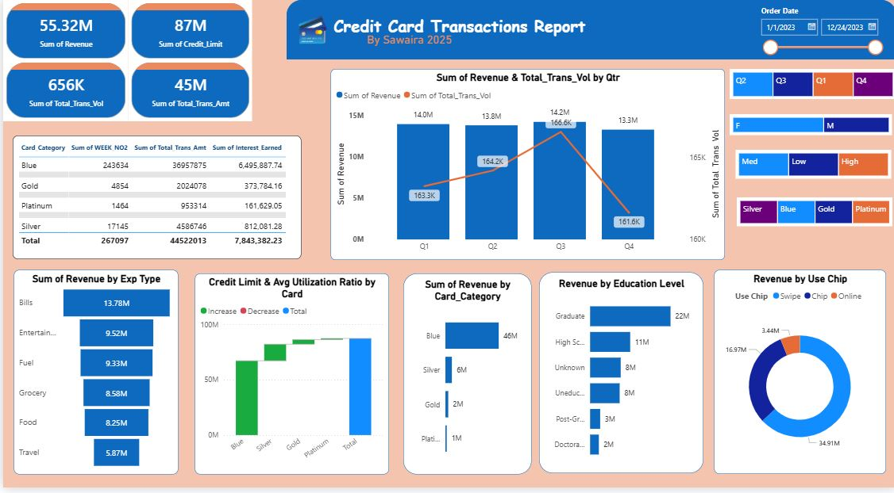

# 💳 Credit Card Transactions Dashboard – Power BI + PostgreSQL  

This repository contains an end-to-end **Credit Card Financial Dashboard** project built using **Power BI** and **PostgreSQL** by **Sawaira (2025)**. The project integrates raw transaction and customer data, applies **DAX measures** and **SQL modeling**, and provides actionable insights into revenue, customer segmentation, spending trends, and credit utilization.  


The dashboard highlights:  
- 📌 **KPI Metrics** – Total Revenue (55.32M), Credit Limit (87M), Transactions Volume (656K), and Total Transaction Amount (45M).  
- 📊 **Visual Analytics** – Revenue by Expense Type, Education Level, Card Category, and Usage Type.  
- 🔍 **Segmentation** – Insights by Age Group, Income Group, Gender, Education, and State.  
- ⚡ **Trends** – Weekly and Quarterly transaction patterns, Current Week Revenue tracking, and utilization ratios.  
- 🛠️ **SQL + DAX Integration** – Data cleaning, new calculated columns, and advanced measures for accurate analytics.  

### 🧮 DAX Formulas  
```DAX
-- Age Group
AgeGroup = SWITCH(TRUE(),
    'customer'[Customer_Age] < 30, "20-30",
    'customer'[Customer_Age] < 40, "30-40",
    'customer'[Customer_Age] < 50, "40-50",
    'customer'[Customer_Age] < 60, "50-60",
    'customer'[Customer_Age] >= 60, "60+",
    "unknown")

-- Income Group
IncomeGroup = SWITCH(TRUE(),
    'customer'[Income] < 35000, "Low",
    'customer'[Income] >= 35000 && 'customer'[Income] < 70000, "Med",
    'customer'[Income] >= 70000, "High",
    "unknown")

-- Revenue
Revenue = 'card_credit'[Annual_Fees] + 'card_credit'[Interest_Earned] + 'card_credit'[Total_Trans_Amt]

-- Week Number
WEEK_NO2 = WEEKNUM('card_credit'[Week_Start_Date])

-- Current Week Revenue
Current_week_Revenue =
CALCULATE(
    SUM('card_credit'[Revenue]),
    FILTER(
        ALL('card_credit'),
        'card_credit'[WEEK_NO2] = MAX('card_credit'[WEEK_NO2])
    )
)


CREATE DATABASE ccdb;

-- Credit Card Details
CREATE TABLE cc_detail (
  Client_Num INT,
  Card_Category VARCHAR(20),
  Annual_Fees INT,
  Activation_30_Days INT,
  Customer_Acq_Cost INT,
  Week_Start_Date DATE,
  Week_Num VARCHAR(20),
  Qtr VARCHAR(10),
  current_year INT,
  Credit_Limit DECIMAL(10,2),
  Total_Revolving_Bal INT,
  Total_Trans_Amt INT,
  Total_Trans_Ct INT,
  Avg_Utilization_Ratio DECIMAL(10,3),
  Use_Chip VARCHAR(10),
  Exp_Type VARCHAR(50),
  Interest_Earned DECIMAL(10,3),
  Delinquent_Acc VARCHAR(5)
);

-- Customer Details
CREATE TABLE cust_detail (
  Client_Num INT,
  Customer_Age INT,
  Gender VARCHAR(5),
  Dependent_Count INT,
  Education_Level VARCHAR(50),
  Marital_Status VARCHAR(20),
  State_cd VARCHAR(50),
  Zipcode VARCHAR(20),
  Car_Owner VARCHAR(5),
  House_Owner VARCHAR(5),
  Personal_Loan VARCHAR(5),
  Contact VARCHAR(50),
  Customer_Job VARCHAR(50),
  Income INT,
  Cust_Satisfaction_Score INT
);

-- Import Data
COPY cc_detail
FROM 'D:\PowerBI Projects-SAWAIRA\Credit Card Dashboard\credit_card.csv'
DELIMITER ','
CSV HEADER;

COPY cust_detail
FROM 'D:\PowerBI Projects-SAWAIRA\Credit Card Dashboard\customer.csv'
DELIMITER ','
CSV HEADER;

-- Add More Data
COPY cc_detail
FROM 'D:/cc_add.csv'
DELIMITER ','
CSV HEADER;


📌 Use Case

This project is ideal for:

Business analysts monitoring financial KPIs

Banks/fintechs evaluating customer segments & risks

Data professionals showcasing Power BI + SQL skills

👩‍💻 Author: Sawaira Iqbal
⭐ If you found this project useful, give it a star!

